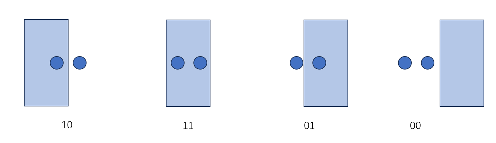

# Benewake(北醒) TF-Luna (TTL) 雷达基于WiFi LoRa 32 (V3)的通道人流量监测项目


# 一.前言

   应用场景：在超市、图书馆、地铁等公共区域，需要对不同出入通道人流量进行统计，需要考虑成本问题以及隐私性，只需要统计出入流量，不搜集其他信息。 统计主要通道出入口客流量和流动方向，辅助优化门店布局，客流疏导等，统计门店各区域客流量，辅助分析区域繁忙度与商品吸引度，优化人员调度、商品陈列、广告位设置、商品备货预测等，相较于人脸识别摄像头，不会采集人脸图像，有效保护个人隐私，规避隐私投诉风险。
   


----


# 二.硬件介绍

   | 物料     |  数量   |
   | --- | --- |
   |   HELTEC ESP32 Boards v3  |  x1  |
   |      TF-Luna (TTL)            |   x2   |

## 1.TF-Luna 简要说明
   

相关链接：https://blog.csdn.net/zoran_wu/article/details/121850480
## 2.WiFi LoRa 32 (V3)


官方资料请参考 :
https://heltec.org/project/wifi-lora-32-v3/
https://docs.heltec.org/zh_CN/node/esp32/wifi_lora_32/index.html

# 三.编译环境搭建
## 1.安装Arduino
 参考官方教程 https://docs.heltec.org/general/how_to_install_git_and_arduino.html
 下载地址： https://www.arduino.cc/en/Main/Software 

双击安装 Arduino 


## 2.安装芯片包和查看例程
### 通过本地文件的方式
下载开发环境：https://resource.heltec.cn/download/tools/WiFi_Kit_series.zip
打开 Arduino IDE，然后单击 -> FilePeferences

转到红色框中的文件夹。

在 Arduino 文件夹中创建一个新的“硬件”文件夹。如果已经有一个“硬件”文件夹，则无需创建新文件夹。

转到“硬件”文件夹并将“WiFi_Kit_series”提取到此文件夹中。

进入“WiFi_Kit_series”文件夹，参考下图确认红框中的路径是否正确。

重新启动 Arduino IDE，确认开发环境是否安装成功。


---
# 四.各功能模块设计
## 1.总体思路：
::: alert-info
### 识别进或者出的逻辑：
考虑人行走时的特点，需要实现可以分辨出是进还是出，并分开统计，在完成完整的进入或者出去的动作之后才进行计数。
设计方案为平行等高横向地安装两个雷达：

行人与两雷达相对位置的四个状态：

识别两个动作

增加 ：10->11->01  
减小： 01->11->10   
完成动作则进行增减
存储下时间上连续变化的三个状态，识别到完成了相应动作后，进行计数。
### 距离自适应逻辑：
两个雷达每测量一次得到值L0都与设定的测量距离L1进行比较，如果连续一段时间测得L0和L1的误差都超过了5cm，便自动更新测量距离为当前雷达测量值 L1。

L1、L2跟随通道宽度实际距离变动。

:::
**读取两个雷达值，并判断当前状态和有无完成进门或者出门的动作**
```


void Action_detection()
{  
    getLidarData(&Lidar);   //读雷达1数据
    getLidarData1(&Lidar1); //读雷达2数据

   if( abs(Lidar.distance - Lidarinit) > 5 || abs(Lidar1.distance - Lidarinit1) > 5)  //如果和设定的测量范围的差值超过五厘米
      ReferenceNum --;
  else 
      ReferenceNum = ReferenceNumVal;     

   if(ReferenceNum < 1)  //差值超过5厘米，每次减一，100次检查差值都超过5厘米，就更新设定的范围
    {
      Lidarinit =  Lidar.distance;
      Lidarinit1 = Lidar1.distance;
      ReferenceNum = ReferenceNumVal;
    }

 
//根据两个雷达的被遮挡情况，分成 00 10 11 01 四种情况
  if(Lidar.distance > (Lidarinit*high) && Lidar1.distance < (Lidarinit1*Low) )
  { 
    State = 0x01;
  }
  if(Lidar.distance < (Lidarinit*Low) && Lidar1.distance < (Lidarinit1*Low) )
  { 
    State = 0x11;
  }
  if(Lidar.distance < (Lidarinit*Low) && Lidar1.distance > (Lidarinit1*high) )
  { 
    State = 0x10;
  }
   if(Lidar.distance > (Lidarinit*high) && Lidar1.distance > (Lidarinit1*high) )
  { 
    State = 0x00;
  }

//  存储连续的三个状态，用于判断动作 

  if(State!=Current_State) //状态发生改变
  {
    BeLast_State = last_State;   //存储上上次
    last_State = Current_State;  //存储上次
    Current_State = State;       //存储当前，用作实时比较
  }


  if (BeLast_State==0x01 && last_State == 0x11  && Current_State ==0x10)   //发生了进门动作
  {
    CoverSumIN ++;
    EEPROM.write(20, CoverSumIN);delay(1);  
    EEPROM.commit();delay(1) ;
    BeLast_State  = 0x00 ;
    last_State    = 0x00  ;
    Current_State = 0x00;
    ActionFlag = 1 ;
  }

  if (BeLast_State==0x10 && last_State == 0x11  && Current_State ==0x01)   //发生了出门动作
  {
    CoverSumOut ++;
    EEPROM.write(40, CoverSumOut);delay(1);  
    EEPROM.commit();delay(1) ;
    BeLast_State  = 0x00 ;
    last_State    = 0x00 ;
    Current_State = 0x00 ;
    ActionFlag = 1 ;
  }
}

```


## 2.功能模块介绍
### （1）串口读取并处理雷达数据
**北醒TF-luna(TTL)协议说明**
     详细可参考北醒官网最新使用说明书：
     https://www.benewake.com/DataDownload/index_pid_20_lcid_21.html

::: alert-info

引脚 5 悬空或者接 3.3V 时，TF-Luna 启动为串口通信模式，引脚 2 为串口接收 RXD，引脚 3 为串口发送 TXD。
串口通信硬件协议为：数据位 8bit，停止位 1bit，无奇偶校验，默认波特率**115200bps**。

:::


**雷达硬件接线图：**

**串口2读取一帧数据，并用串口0打印出雷达距离信息的示例代码：**
```
#include "HardwareSerial.h"   
//雷达数据结构体
typedef struct {
  int distance = 0;        //距离
  int strength = 0;        //信号强度
  int ID   = 0;            //雷达 ID

  long int BaudRate = 0;

  boolean LidarFlag = false;
  boolean receiveComplete = false;
  boolean IO = 0;
} TF;
TF Lidar;

void getLidarData( TF* Lidar);

void setup() {
   Serial.begin(115200);  //串口0 用于打印调试
   Serial2.begin(115200, SERIAL_8N1, 45, 46);  //https://gitee.com/huangchangbing/vnote-image-host/raw/master/教程/人员检测.md/410101610242505.png45是Rx，GPIO46是Tx
}

void loop() {
  getLidarData(&Lidar) ;
  Serial.print(Lidar.distance);
  Serial.println("cm");
  delay(500);
}


/* void getLidarData( TF* Lidar) 
   串口获取一帧数据，并计算距离，信号强度和记录成功计算的标志。
*/
void getLidarData( TF* Lidar)  
{ 
  //59 59 03 00 E9 09 68 09 18  一帧数据
  static char i = 0;
  char j = 0;
  int checksum = 0;
  Lidar->receiveComplete = false; 
  static int rx[9] ;
  while (Serial2.available() > 0) {
     rx[i] = Serial2.read();
    if (rx[0] != 0x59) {
      i = 0;
    } else if (i == 1 && rx[1] != 0x59) {
      i = 0;
    } else if (i == 8) {
      for (j = 0; j < 8; j++) {
        checksum += rx[j];      //计算校验和
      }
      if (rx[8] == (checksum % 256)) {
        Lidar->distance = rx[2] + rx[3] * 256;  //距离
        Lidar->strength = rx[4] + rx[5] * 256;  //信号强度
        Lidar->receiveComplete = true;          //接收完成
      }
      i = 0;
    } else {
      i++;
    }
   } 
}
```
串口信息：


### （2）Oled显示
**屏幕显示字符串的例程**
```
#include <Wire.h>               
#include "HT_SSD1306Wire.h"

SSD1306Wire  display(0x3c, 500000, SDA_OLED, SCL_OLED, GEOMETRY_128_64, RST_OLED); // addr , freq , i2c group , resolution , rst

void setup() {
  // put your setup code here, to run once:
  display.init();  //屏幕初始化
  display.setFont(ArialMT_Plain_16);   //设置字体
}

void loop() {
  // put your main code here, to run repeatedly:
  display.clear();
  display.drawString(0, 0, "Hello");  //X,Y,内容
  display.display();  //将缓冲区写入内存
  delay(1000);
  display.clear();
  display.drawString(0, 0, "Hi");  //X,Y,内容
  display.display();  //将缓冲区写入内存
  delay(1000);
  
}
```


### （3）使用Flash-EEPROM
  为了掉电后也能保存住记录过的信息 
  ```#include <EEPROM.h>

int num = 123;

void setup() {
  Serial.begin(115200);
  EEPROM.begin(4096);    //申请空间，传入参数为size，为需要读写的数据字节最大地址+1，取值1~4096；

  EEPROM.write(20, num);delay(1);   //传入的地址，和传入的数据
  EEPROM.commit();delay(1);  //在写好所有的更改之后，保存更改的数据


    Serial.print("ESP 32 读取模式，取出数据：");
    Serial.println(EEPROM.read(20));  //读数据，里面填写的参数为地址，需要与上面的写入地址一样才可以正常读出上面我们写入的数据   
}

void loop() {


}

  ```

---

# 五.工程代码烧录
## 1.工程代码烧录
完整工程GIthub仓库：[Personnel-testing.git](https://github.com/CompletelyInsane/Personnel-testing.git)
>1. 下载工程

>2. 下载解压，进入目录 

>3. 双击打开工程

>4. 在设备管理器中查看对应端口

>5. 正确选择开发板和端口


>6. 编译上传

 
## 2.接线图

## 3.安装方式
横向平行安装两个雷达，雷达的间距可以根据具体情况调整，合适的间距能过滤掉干扰。

## 4.显示效果
IN和OUT数据掉电也不会消失，摁下PRG按键清空数据

